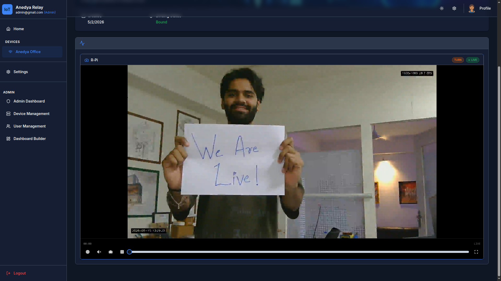

[](https://docs.anedya.io?utm_source=github&utm_medium=link&utm_campaign=github-examples&utm_content=pi-cam)


<p align="center">
    
</p>

# Pi Cam - CCTV Camera with Anedya + WebRTC



Turn a Raspberry Pi into a CCTV-style camera system using Anedya for signaling and TURN relay provisioning, and WebRTC for real-time video delivery.

## ✨ Features

- **Live WebRTC video streaming :** low-latency peer-to-peer video using Anedya-managed STUN/TURN
- **Local Recording :** continuous MP4 segments written to disk on the Pi
- **Playback :** scrub through past footage from the viewer without any server-side transcoding
- **Automatic max camera mode :** selects the highest usable camera capability for both live streaming and local recording
- **Motion detection overlay :** bounding boxes drawn on detected motion regions in real time
- **Microphone audio :** capture and stream Pi microphone audio alongside video
- **Web viewer :** browser-based viewer, no install required
- **Mobile viewer :** Flutter app for Android and iOS

---

## 🏗 How It Works

### Signaling via Anedya ValueStore + MQTT

WebRTC requires both peers to exchange SDP offers and answers before media can flow. This example uses Anedya ValueStore as a signaling channel and Anedya MQTT as the notification mechanism.

```
Peer App
  │  1. Fetch TURN credentials (Anedya REST API)
  │  2. Create WebRTC offer + write offer_<sessionId> to ValueStore
  ▼
Anedya Cloud  (ValueStore + MQTT broker + TURN relay)
  │  3. Notify Pi over MQTT subscription
  ▼
Pi Streamer
  │  4. Create WebRTC answer + write answer_<sessionId> to ValueStore
  ▼
Peer App
  │  5. Poll ValueStore → read answer → apply remote description
  │  6. ICE negotiation completes
  │  7. Media flows (video + audio) — DataChannel for playback controls
```

<p align="center">
    
</p>

### WebRTC Connectivity

When both peers are on the same network, ICE resolves a direct path using STUN address discovery:

<p align="center">
    
</p>

When a firewall blocks direct peer-to-peer traffic, Anedya's managed TURN relay is used automatically:

<p align="center">
    
</p>

### Recording and Playback

The Pi records continuously into configurable MP4 segments on disk. The default segment duration is 5 seconds and can be changed with `RECORDING_SEGMENT_SECONDS`. Finalized recordings are kept for 7 days by default; change this with `RECORDING_RETENTION_DAYS`, `RECORDING_RETENTION_HOURS`, or `RECORDING_RETENTION_SECONDS` for short test windows. The viewer receives a timeline over the WebRTC DataChannel and can seek into any finalized segment using the same data channel; the Pi reads and streams the file directly.

<p align="center">
    
</p>

---

## 📁 Repository Layout

```
.
├── peer/                   — browser viewer (static HTML + Node.js dev server)
│   └── public/
│       └── index.html
├── peer_app/               — Flutter mobile viewer (Android / iOS)
│   └── lib/
│       ├── main.dart
│       ├── peer_cam_screen.dart
│       └── qr_code_scanner.dart
└── streamer/               — Pi device app (Python)
    ├── config.py           — credentials, constants, logging
    ├── recording.py        — rolling MP4 segment writer
    ├── camera.py           — capture loop, motion detection, timestamp overlay
    ├── tracks.py           — WebRTC video and audio tracks
    ├── camera_streamer.py  — MQTT signaling, peer connection handling
    └── main.py             — CLI entrypoint
```

---

## 🚀 Getting Started

### What You Need

**Hardware**
- Raspberry Pi with network access (any model with USB or CSI camera support)
- USB/UVC webcam (recommended) or CSI camera module
- Optional: USB microphone for audio

**Software / Accounts**
- Raspberry Pi OS or any Linux environment
- Python 3.11+
- [`uv`](https://docs.astral.sh/uv/guides/projects/) : Python package manager
- An [Anedya](https://anedya.io?utm_source=github&utm_medium=link&utm_campaign=github-examples&utm_content=pi-cam) account

---

### Step 1: Create Your Anedya Project

1. Sign in at [Anedya Console](https://console.anedya.io).
2. Create a new project.
3. Create a node for your Pi camera and pre-authorize it with a UUID.
4. Note down these values, you will need them in Step 3:

| Value | Where to find it |
|---|---|
| `ANEDYA_DEVICE_ID` | Node details → Device ID |
| `ANEDYA_NODE_ID` | Node details → Node ID |
| `ANEDYA_CONNECTION_KEY` | Node details → Connection Key |

5. Generate a **Platform API key** for the viewer app.

> [!TIP]
> See [Anedya Project Setup](https://docs.anedya.io/getting-started/project-setup/) for a step-by-step walkthrough of the console.

---

### Step 2: Clone the Repository

Clone on the **Raspberry Pi**:

```bash
git clone https://github.com/anedyaio/anedya-camera-livestream-example.git
cd anedya-camera-livestream-example
```

---

### Step 3: Configure the Pi Streamer

Create the local credentials file from the example:

```bash
cp streamer/.env.example streamer/.env
```

Edit `streamer/.env` and fill in your values:

```env
ANEDYA_DEVICE_ID=your-device-uuid
ANEDYA_NODE_ID=your-node-uuid
ANEDYA_CONNECTION_KEY=your-connection-key
ANEDYA_REGION=ap-in-1
RECORDING_SEGMENT_SECONDS=5
RECORDING_RETENTION_DAYS=7
RECORDING_RETENTION_HOURS=0
RECORDING_RETENTION_SECONDS=
```

Install `uv` if not already present:

```bash
curl -LsSf https://astral.sh/uv/install.sh | sh
```

Install Python dependencies:

```bash
cd streamer
uv sync
```

If you want microphone audio on Raspberry Pi OS or Debian, install the system
PortAudio runtime before starting the streamer:

```bash
sudo apt install libportaudio2
```

This is only required for audio. Video-only mode works without PortAudio by
running the streamer with `--no-audio`.

---

### Step 4: Run the Streamer

```bash
uv run streamer
```

**Options:**

```bash
uv run streamer --camera 1          # use a different camera device index
uv run streamer --no-audio          # disable microphone
uv run streamer --record-path /mnt/recordings  # custom recording directory
```

---

### Step 5: Connect a Viewer

#### Option A : Web Viewer

A hosted version is available at: **[anedyaio.github.io/anedya-camera-livestream-example](https://anedyaio.github.io/anedya-camera-livestream-example/)**

Or run it locally on your PC/Mac:

```bash
cd peer
npm install
npm start
```

Open `http://localhost:8080` in your browser, then:
1. Click **Settings**
2. Enter your **Node ID** and **Platform API key**
3. Click **Start Stream**

#### Option B : Mobile App (Android)

Download the latest APK from [GitHub Releases](../../releases) and install it on your Android device.

Or build from source:

```bash
cd peer_app
flutter pub get
flutter run
```

In the app,
1. Click **Settings**
2. Enter your **Node ID** and **Platform API key**
3. Click **Start Stream**

---

## 📺 Playback and Control

After the first segment is finalized, a timeline scrubber appears in the viewer. Drag it to seek into recorded footage. The Pi streams frames from the MP4 files directly using the same WebRTC connection by switching the frames it yields; no upload or cloud storage involved.

---

## 📷 Camera Notes

This project uses OpenCV `VideoCapture`.

- **USB/UVC webcams** work out of the box on most Pi setups.
- **CSI cameras** (Pi Camera Module): ensure the camera is enabled in `raspi-config` and test with `libcamera-still` before running the streamer.
- **Linux / Raspberry Pi**: the streamer uses `linuxpy` to enumerate V4L2 camera modes, selects the highest usable resolution/FPS mode, then applies that mode to OpenCV.
- **Windows**: the streamer uses FFmpeg DirectShow mode listing through `imageio-ffmpeg` when available, then applies the selected mode to OpenCV.
- If capability discovery fails on either platform, the streamer falls back to OpenCV resolution probing.
- The selected capture mode is shared by both the WebRTC live stream and the MP4 recorder.
- If capture fails on index `0`, try `--camera 1` or check `ls /dev/video*`.

---

## 📚 References

**Anedya**
- [Anedya Overview](https://docs.anedya.io/anedya-overview/)
- [Anedya Concepts](https://docs.anedya.io/essentials/concepts/)
- [Anedya Project Setup](https://docs.anedya.io/getting-started/project-setup/)
- [Anedya MQTT Endpoints](https://docs.anedya.io/device/mqtt-endpoints/)
- [Anedya ValueStore](https://docs.anedya.io/features/valuestore/valuestore-intro/)
- [Anedya Platform API](https://docs.anedya.io/platform-api/)

**WebRTC**
- [WebRTC Overview](https://webrtc.org/getting-started/overview)
- [WebRTC Peer Connections](https://webrtc.org/getting-started/peer-connections)

**Tooling**
- [uv - Python package manager](https://docs.astral.sh/uv/guides/projects/)
- [Raspberry Pi Camera Software](https://www.raspberrypi.com/documentation/computers/camera_software.html)

---

## License

This project is licensed under the [Apache License 2.0](LICENSE).
